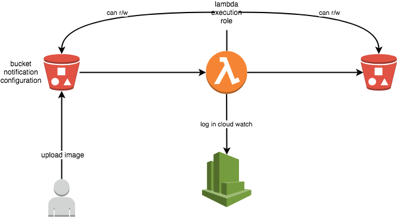

# Description

This is an implementation of the Aws tutorial with terraform : https://docs.aws.amazon.com/lambda/latest/dg/with-s3.html

This will use **us-west-2** region

Run **make** to list the available targets

# Architecture

