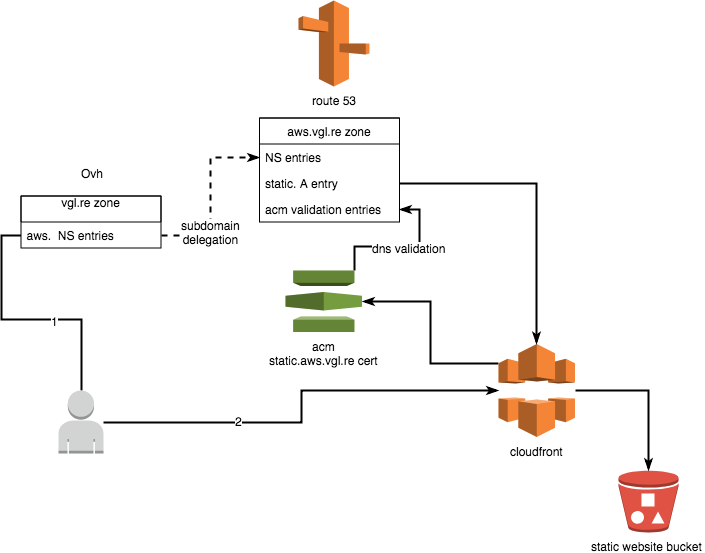

# Introduction


```
make help
```

# Architecture



# Ovh

Go to https://api.ovh.com/createToken/index.cgi?GET=/*&POST=/*&PUT=/*&DELETE=/* for generating :

- application_key
- application_secret
- consumer_key

And create in **~/.ovh.conf**:

```
[ovh-eu]
application_key=<my_application_key>
application_secret=<my_application_secret>
consumer_key=<my_consumer_key>
```
